\newpage

# Lógica de creación del modelo estrella

A continuación, se explicará de forma breve el proceso para llegar al modelo estrella seleccionado.

## Modelo relacional original

En la Figura 1, se muestra el modelo relacional original.

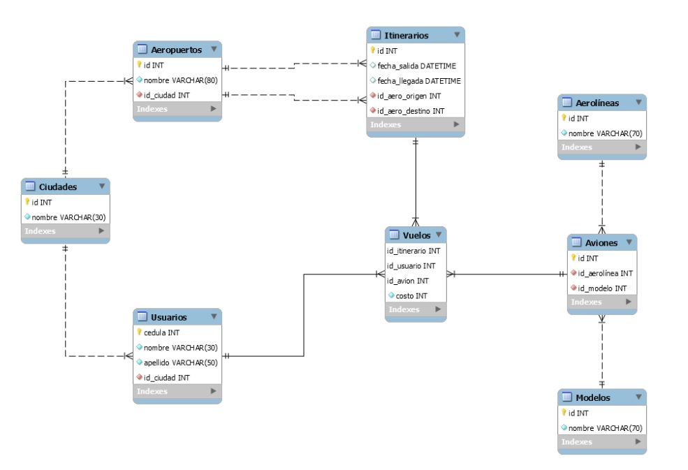

Del mismo modo, podemos observar las siguientes relaciones en el modelo:

  * Los vuelos se relacionan con los itinerarios, donde cada itinerario puede contar con varios vuelos.
  * Los vuelos se relacionan con los aviones, donde cada avión puede tener varios vuelos.
  * Los vuelos se relacionan con los usuarios, donde cada usuario puede realizar varios vuelos.
  * Los aviones se relacionan con los modelos, donde cada modelo puede tener varios aviones.
  * Los aviones se relacionan con las aerolíneas, donde cada aerolínea puede tener varios aviones.
  * Los usuarios se relacionan con las ciudades, donde cada ciudad puede tener varios usuarios.
  * Los itinerarios se relacionan con los aeropuertos, donde cada aeropuerto puede tener varios itinerarios de origen o varios itinerarios de destino.
  * Los aeropuertos se relacionan con las ciudades, donde cada ciudad puede tener varios aeropuertos.

Se entiende que los vuelos hacen referencia a cada pasaje vendido a un usuario.

## Requerimientos de análisis

A continuación, se presentan las preguntas a las cuales se busca dar respuesta mediante este análisis:

* ¿Cuál aerolínea realizó el mayor número de vuelos a la ciudad de Roma en el año 2019 y cuál en el año 2020?
* Total de dinero recaudado por vuelos de cada aerolínea en el primer semestre del año 2019 y en el primer semestre del año 2020.
* ¿Cuál modelo de avión realizó el mayor número de vuelos en el año 2019 y cuál en el año 2020?
* ¿Cuál fue la ciudad cuyos habitantes viajaron más en el año 2019 y cuál en el año 2020?

## Análisis de los hechos

De los requerimientos de análisis, podemos observar que los hechos buscados están relacionados con el conteo de vuelos y el costo total de los vuelos. Por lo tanto, la tabla principal en la que nos podemos basar es la de VUELOS.

## Análisis de las dimensiones

De las preguntas de negocio identificamos las dimensiones: aerolínea, ciudad de destino, fecha, modelo de avión y ciudad del usuario. Estas cinco dimensiones deben ser modeladas para poder extraer las cantidades y el costo total de los hechos.

## Análisis de los indicadores

Las dos medidas solicitadas son cantidades, entendidas como el conteo de vuelos, y total costo, entendido como la suma del campo costo de cada vuelo.

## Análisis de las jerarquías.

Análisis de las jerarquías

Teniendo en cuenta las preguntas y dimensiones identificadas, a excepción de la dimensión fecha, que cuenta con los niveles de fecha, año y semestre, las demás jerarquías cuentan con un solo nivel de la siguiente forma:

  * AEROLINEAS
  * CIUDAD DESTINO
  * CIUDAD USUARIO
  * FECHAS -> ANNIO -> SEMESTRE
  * MODELOS

## Diagrama del Modelo

Teniendo en cuenta todo el análisis previo, nuestro diagrama de estrella presenta en el centro la tabla de hechos VUELOS, que incluye las medidas COSTO y CANTIDAD, junto con los identificadores para relacionarla con las dimensiones AEROLINEAS, CIUDAD_DESTINO, CIUDAD_USUARIO, FECHA y MODELOS, como se muestra en la Figura 2.

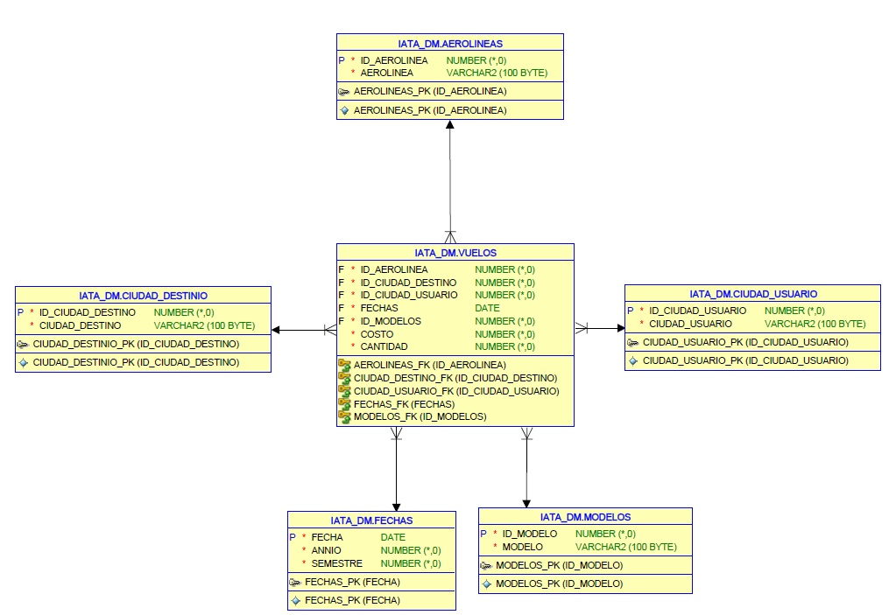

Cabe destacar que este modelo ha sido creado a medida para responder a las preguntas de interés del caso actual.

# Construcción Data Mart.

Para la construcción del Data Mart se utilizó SQL Developer, creando el esquema IATA_DM y las tablas y columnas como se muestran en la Figura 3.

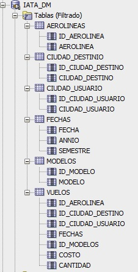

Se crean las claves primarias.
* AEROLINEAS_PK
* CIUDAD_DESTINO_PK
* CIUDAD_USUARIO_PK
* FECHAS_PK
* MODELOS_PK

Igualmente se crean las llaves foráneas.
* AEROLINEAS_FK
* CIUDAD_DESTINO_FK
* CIUDAD_USUARIO_FK
* FECHAS_FK
* MODELOS_FK

Las relaciones entre las tablas, las llaves foráneas y las llaves primarias, así como el tipo de datos, se pueden apreciar en el gráfico relacional del modelo estrella presentado anteriormente en la Figura 2.

# Construcción Cubo OLAP

Para la construcción del cubo OLAP, se utilizó la herramienta Pentaho Workbench. Se creó el cubo IATA_CUBE_GRUPO4A, al cual se agregó la tabla de hechos VUELOS y las dimensiones siguientes:

  * Dimensión AEROLINEAS con la jerarquía AEROLINEA y la tabla AEROLINEAS.
  * Dimensión CIUDAD_DESTINO con la jerarquía CIUDAD_DESTINO y la tabla CIUDAD_DESTINO.
  * Dimensión CIUDAD_USUARIO con la jerarquía CIUDAD_USUARIO y la tabla CIUDAD_USUARIO.
  * Dimensión FECHAS con las jerarquías AÑO, SEMESTRE y la tabla FECHAS.
  * Dimensión MODELOS con la jerarquía MODELOS y la tabla MODELOS.

Además, se incluyeron las medidas siguientes:

  * Medida COSTO, que es la suma de la columna COSTO en la tabla de hechos.
  * Medida CANTIDAD, que es el conteo de la tabla CANTIDAD en la tabla de hechos.

La estructura completa del cubo OLAP se puede apreciar en la Figura 4.

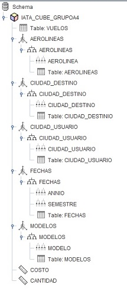

# Proceso de ETL

El proceso de ETL se llevó a cabo utilizando la herramienta Pentaho Integration Services. Para esto, se creó un flujo de trabajo para cada una de las tablas de dimensiones y la tabla de hechos del Data Mart. En cada flujo, se utilizó un componente de entrada (Input) que ejecuta una consulta SQL para extraer los datos de la base de datos IATA. Luego, se aplicaron transformaciones a los datos y se depositaron en el Data Mart IATA_DM, como se muestra en la Figura 5.

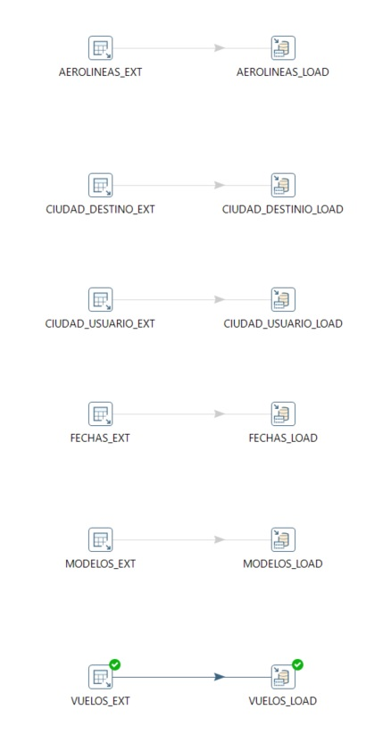

Las consultas utilizadas se pueden ver en las Figuras 6 a 10.

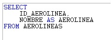

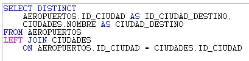

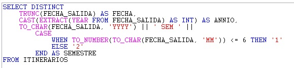

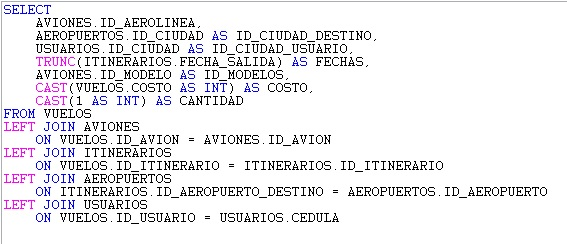

# Solución Requerimientos de análisis.

Para dar respuesta a los requerimientos de análisis, se utilizó la herramienta LinceBI. Se estableció una conexión entre LinceBI y el Data Mart IATA_DM, así como con el cubo IATA_CUBE_GRUPOA4, con el fin de visualizar los resultados de manera efectiva y realizar análisis en base a los datos almacenados en el Data Mart y el cubo OLAP. La utilización de LinceBI permitió explorar y visualizar de manera interactiva los datos.

## ¿Cuál aerolínea realizó el mayor número de vuelos a la ciudad de Roma en el año 2019 y cuál en el año 2020?

En la Figura 11 se muestra la visualización creada para dar respuesta al requerimiento.

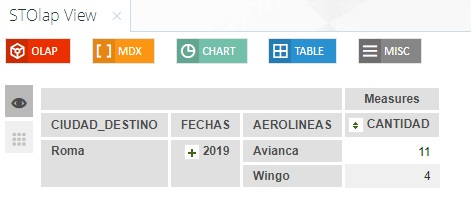

La aerolínea que realizó el mayor número de vuelos a la ciudad de Roma en el año 2019 fue Avianca. Sin embargo, según los datos suministrados, para el año 2020 no se registraron vuelos a la ciudad de Roma.

## Total de dinero recaudado por vuelos de cada aerolínea en el primer semestre del año 2019 y en el primer semestre del año 2020.

En la Figura 12 se muestra la visualización creada para dar respuesta al requerimiento.

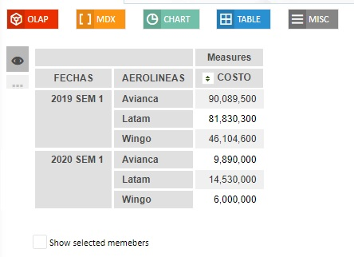

En la misma tabla de la Figura 12 se pueden observar los ingresos por recaudos de cada una de las aerolíneas para el primer semestre de los años 2019 y 2020.

## ¿Cuál modelo de avión realizó el mayor número de vuelos en el año 2019 y cuál en el año 2020?

En la Figura 13 se muestra la visualización creada para dar respuesta al requerimiento.

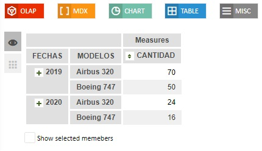

Tanto en el año 2019 como en el 2020, el modelo de avión que registró el mayor número de vuelos fue el Airbus 320.

## ¿Cuál fue la ciudad cuyos habitantes viajaron más en el año 2019 y cuál en el año 2020?

En la figura 14 podemos ver la visualización creada para dar respuesta al requerimiento.

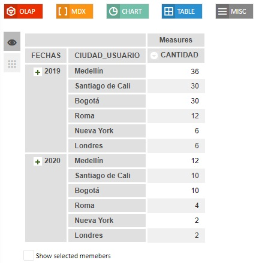{width=300px}

Tanto en el año 2019 como en el 2020, los habitantes de la ciudad de Medellín fueron quienes realizaron el mayor número de vuelos.

# Reflexión: Importancia de las herramientas de gestión de datos y los procesos ETL en el análisis y transformación de información.

La implementación de herramientas como el datamart, el cubo OLAP y los procesos ETL resultan fundamentales en la gestión de diversas fuentes de datos y permiten organizarlos de manera eficiente para realizar procesos de análisis de datos a mediano o largo plazo. Estas herramientas ofrecen una estructura y una lógica de almacenamiento optimizada para consultas analíticas, lo que facilita la extracción de información valiosa de grandes volúmenes de datos.

El datamart proporciona un entorno de datos específicamente diseñado para satisfacer las necesidades de análisis de un área o departamento en particular. Al construirlo sobre una base de datos relacional, se logra una estructura flexible que permite almacenar y gestionar datos históricos de forma eficiente. Además, el cubo OLAP permite la agregación y el análisis multidimensional de los datos del datamart, lo que facilita la visualización y el descubrimiento de patrones y tendencias.

En cuanto a los procesos ETL, desempeñan un papel crucial en la transformación y carga de datos en el datamart. Estos procesos permiten extraer datos de diferentes fuentes, realizar las transformaciones necesarias para adaptarlos al esquema del datamart y cargarlos de manera eficiente. Esto asegura la integridad y calidad de los datos en el datamart, lo que a su vez garantiza resultados precisos en los análisis posteriores.

Respecto a la posibilidad de utilizar procesos ETL para transformar datos de una base de datos relacional a una base de datos NoSQL, es importante destacar que los procesos ETL están diseñados específicamente para la extracción, transformación y carga de datos en entornos relacionales. Por lo tanto, su aplicación directa a una base de datos NoSQL puede no ser la solución más adecuada.

NoSQL se refiere a una amplia gama de bases de datos que se diferencian de las bases de datos relacionales en su estructura y enfoque de almacenamiento. Estas bases de datos están diseñadas para manejar grandes volúmenes de datos no estructurados o semiestructurados de manera eficiente. En este contexto, los procesos ETL pueden no ser necesarios, ya que la estructura de datos en una base de datos NoSQL es más flexible y puede adaptarse directamente a los requisitos del análisis de datos sin la necesidad de transformaciones complejas.

