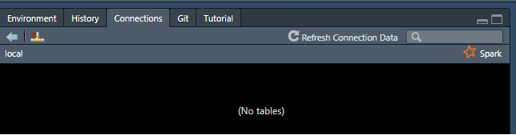
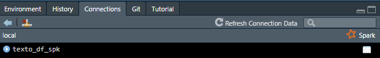
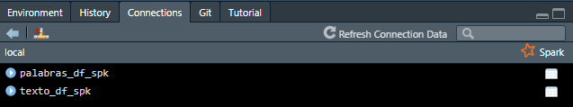
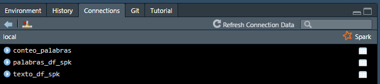
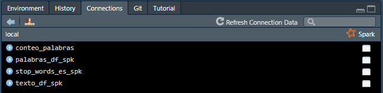
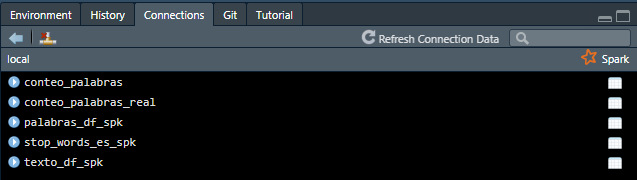

\newpage

# Introducción

Para a actividad e contedo de palabras se selecciono el trabajo de grado "Apoyo Tecnológico en la Inversión en Renta Variable" escrito por Román Zamora Carreras para la obtención de su doble tutilacióne en Ingenieria Informatica y Adminitración de la Universidad Politécnica de Madrid. Dicho Articulo cuenta con un total de 71 paginas y se entrega como documento anexo al presente estudio.

Para el desarrollo del presente ejercicio se escoje la herramienta Spark ya que contine integrado funciones de analisis de texto lo cual hara más facil y rapido nuestro analisis en comparación con Hadoop MapReduce donde tendiramos que escribir nuestras fucniones. Para interactuiar con Spark usaremos R, en espeficio la libreria sparkly la cual ofrece el trabajar con Spark, mediante SparkSQL, usando una interfase similar a las de los paquetes usados por el tydyverse herramienta popular de R para el procesamiento de datos, de igual forma sparkly ofrece una forma rapida de isntalar y configurar Spark en computadores windows si se quiere trabajar con clustes locales a si como funcionaliudad para conectarse a clusters remotos de Hadoop YARN, Mesos, Kubernetes, Databricks entre otros.

La siguentes son las librerias de R a usar a lo largo del estudio:


```{r echo=FALSE, message=FALSE, warning=FALSE}
library(tidyverse)
library(sparklyr)
library(pdftools)
library(tidytext)
library(wordcloud)
```

# Procesamiento texto del articulo.

Debido a que el articulo se encuentra en formato PDF, usaremos la libreria `pdftools` para extraer el texto del mismo y lo almacenaremos en el objeto `texto` 

```{r, results="asis"}
texto <- pdf_text("TFG_ROMAN_ZAMORA_CARRERAS.pdf")
```

Revisemos la clase del objeto y su extención.

```{r, results="asis"}
class(texto)
length(texto)
```

Vemos que se obtubo un vector de clase caracter con una longitud de 71, osea un registro por cada pagina del articulo. 

## Limpieza de texto

Nuestra primera limpieza sera eliminar de nuestro vector la pagina 5 que contine el resumen del articculo en idioma ingles, ya que nuestro objetivo es contar las palabras en español, de igual forma se quitaran las paginas 63 a 71 que contienen las referencial bibliograficas, esto debido a que la mayoria estan en ingles y fueron consultadas de paginas web. Como nota en R a diferencia de la mayoria de lenguages de programación los indices comienzan en 1 y no en 0.

```{r, results="asis"}
texto <- texto[-c(5,63:71)]
length(texto)
```

Con esto la longitud de nuestro vector pasa a 61 observaciones. Veamos las dos primera para hacernos a una idea del contenido

```{r, results="asis"}
cat(head(texto,2))
```

----

Vemos entonces que debemos hacer una limpieza adicional, quitando los saltos de linea asi como numeros, puntuaciones y caracteres especiales para asi dejar solo el texto que debera ser utilizado por Spark. Usaremos la libreria stringr contenida en tidyverse para hacer esta limpieza, usando el sigueinte orden:

* Pasar todo el texto a minuscula
* Quitar los saltos de linea
* Dejar solo letras, incluyendo la ñ y todas las vocales con tilde.
* Quitar los dobles espacios.
* Para cada observación (pagína) quitar de existir los espacios al princiío y fin del texto.

Como nota somos concientes que Spark cuenta con funciones similares de limpieza, sin embargo al intentar usarlas se obtuvieron resultados extraños debido a como entiende Spark la codificación del idioma español por lo cual usamos las herramientas de R donde pidumos especifical en el encoding de este idioma.

```{r, results="asis"}
texto <- texto |> 
  str_to_lower() |> 
  str_replace_all("\n", " ") |> 
  str_replace_all("[^a-záéíóúñ\\s]"," ") |> 
  str_replace_all("\\s+", " ") |> 
  str_trim()
```

Veamos de nuevo el resultado con el texto limpio

```{r, results="asis"}
cat(head(texto,2))
```
Como se ve ahora el texto se encuentra en el formato indicado para el analisis en Spark, ahora uniremos las 61 paginas en una sola observación para ser procesada.

```{r, results="asis"}
texto <- paste0(texto, collapse = " ")
class(texto)
length(texto)
```

# Analisis en Spark

## LLevando los datos a Spark
Como primer paso pasaremos nuestro texto aun DataFrame para simular la extrucura que usa Spark para el analisis de datos.


```{r}
texto_df <- tibble(texto = texto)
class(texto_df)
```

Ahora nos conectaremos a un cluster local donde procesaremos el texto por medio de spark.


```{r}
Sys.setenv(JAVA_HOME="C:/Program Files/Java/jre-1.8")
sc <- spark_connect(master = "local")
```

En el momento nuestro cluster local se encuentra vacio como podemos ver en la figura 1.

<center>

</center>

Copiaremos nuetra DataFrame de R a Spark usando la funciónd de sparklyr `copy_to` 

```{r}
texto_df_spk <- copy_to(sc, texto_df,"texto_df_spk", overwrite = TRUE)
```


```{r}
class(texto_df_spk)
```

En la figura 2 vemos como nuestra DataFrame texto_df_spk de Spark ya se encuentra dentro del cluster

<center>

</center>

## Tokenización del texto

Ya con nuestro texto en spark procederemos primero a separar cada una de las palabras en una lista mediante la función `ft_tokenizer` (quien usa por detras la fucion de spark tokenizer), luego cada elemento de esta lista lo pasaremos a una fila de un DataFrame usando la función `explode` de spark. El resultado lo guardaremos en el DataFrame `palabras_df_spk` dentro de nuestro cluster de Spark.

```{r}
palabras_df_spk <- texto_df_spk %>%
  ft_tokenizer(
    input_col = "texto",
    output_col = "lista_palabras"
  ) |> 
  mutate(palabra = explode(lista_palabras)) |> 
  select(palabra) |> 
  compute("palabras_df_spk")
```

La figura 3 muestra la inclusión del DataFrame palabras_df_spk

<center>

</center>

Miremos las primeras 10 filas de `palabras_df_spk`

```{r}
head(palabras_df_spk, 10)
```
## Conteo de palabras

Nuestro siguente paso es generar de este DF que contiene en filas en orden cada una de las palabras del articulo, una agregación para generar un conteo el número de veces que cada una de estas palabras aparece dentro del articulo. Para esto usaremos la función de Spark `count` sobre la columna `palabra`, el resultado lo llevaremos al clustes en un DataFrame denominado `conteo_palabras`.

```{r}
conteo_palabras <- palabras_df_spk |> 
  count(palabra) |> 
  ungroup() |> 
  compute("conteo_palabras")
```


La figura 4 muestra la inclusión del DataFrame conteo_palabras

<center>

</center>

Miremos ahora el top 10 de las palabras más usadas en el articulo

```{r}
conteo_palabras |> 
  arrange(-n) |> 
  head(10)
```

Este top 10 no es muy diciente ya que como era de esperarce cotiene varias de las palabras más usadas dentro del idioma español, por lo cual se hace necesario limpiar este resultado para quitar aquellas palabras que son usadas con frecuencia.

## Removiento Stop Words

Las "stop words" (palabras vacías o palabras de parada) son palabras comunes y muy frecuentes en un idioma que suelen ser excluidas o filtradas durante el procesamiento de texto o análisis de texto. Estas palabras generalmente se consideran irrelevantes para el análisis de texto debido a su alta frecuencia de aparición y aportan poco valor semántico o informativo al contenido.

Entonces para nuestro analisis debemos quitar estas "stop words" para poder hacer sentido del top de palabras de nuestro articulo.

Para esto usaremos la lista de "stop words" en español del paquete de R `tidytext`, esta lista contiene las 308 palabras más usadas del idioma español segun el Lexicon Snowball generado por el algotimo del mismo nombre por el Dr. Martin Porter, para mas información respecto a este Lexicon visitar  https://snowballstem.org/.

En el siguente codígo guardaremos estas 308 palabras en el objeto stop_words_es

```{r}
stop_words_es <- get_stopwords("es")
```

Miremos las primeras 10 palabras de este objeto

```{r}
head(stop_words_es,10)
```
Vemos que varias de las 10 primeras palabras de esta lista coinciden con el top 10 de las palabras más usadas del articulo, por lo cual hace sentido remover estas del articulo para poder hacer un analisis correctamente.


Nuestro siguiente paso sera llevar esta lista como un DataFrame llamado `stop_words_es_spk` en nuestro cluster.

```{r}
stop_words_es_spk <- copy_to(sc, stop_words_es,"stop_words_es_spk", overwrite = TRUE)

```

La figura 5 muestra la inclusión del DataFrame stop_words_es_spk

<center>

</center>

Nuestro siguente paso sera crear el DF `conteo_palabras_real` en el cual tomaremos al DF `conteo_palabras` y le quitaremos aquellas palabras contenidas en `stop_words_es_spk`, lo anterior lo haremos usando la función de sparklyr anti_join (la cual usa por detras la funcionalidad de spark join de tipo anti)


```{r}
conteo_palabras_real <- conteo_palabras |> 
  anti_join(stop_words_es_spk,
            by = c("palabra" = "word")) |> 
  compute("conteo_palabras_real")
```


La figura 6 muestra la inclusión del DataFrame stop_words_es_spk

<center>

</center>

Miremos ahora el top 10 de las palabras más usadas en el árticulo una vez removidas las palabras más comunes del español

```{r}
conteo_palabras_real |> 
  arrange(-n) |> 
  head(10)
```
Nuestro nuevo top 10 hace más sentido y con solo esas primeras 10 palabras podemos hacernos una idea de la tematica del articulo sin haberlo leido previamente.

Como nota vemos dentro del top 10, palabras que contienen el mismo origen como inversión, inversor y activo, activos, esto es debido a que en la limpieza no se llevo acabo un proceso de lematización de las palabras debido a que esto requiere un analisis y metodolgias más profundas y avanzadas que se salen del alcance del presente estidio.

# WordClod

Para finalizar nuestro estudio visualizaremos nuestro resultados mediante un WordCloud que es una representación visual de un conjunto de palabras en la que el tamaño de cada palabra está relacionado con su frecuencia o importancia en un texto o conjunto de datos. 

Primero extraeremos nuestro DF conteo_palabras_real de nuestro cluester de spark y lo llevaremos a R en el DF conteo_palabras_real_R, debio a que mediente esta herramienta realizaremos la visualisación.

```{r}
conteo_palabras_real_R <- collect(conteo_palabras_real)
```

Miremos el tamaño de nuestro DF

```{r}
dim(conteo_palabras_real_R)
```

Vemos un total de 3092 Palabras, para nuestra visaulización usaremos solo las primeras 100 con las cuales creemos se puede caputar la escenia del árticulo. Daremos un tono verde para las más usadas siguendo por un azul, naranja y terminando en un gris para las menos usadas de estas primeras 100 palabras más usadas.

```{r}
with(conteo_palabras_real_R |> 
       arrange(-n) |> 
       head(100),
     wordcloud(
       palabra,
       n,
       scale = c(2.5,.5),
       colors = c("#999999", "#E69F00", "#56B4E9", "#5DAE68")
     ))
```

De nuestra visualización podemos ver que se hace enfacis en palabras como inversión y empresas, seguirdas por activos analisis e indicadores. Confirmamos nuevamente que este conteo de palabras ayuda a entender la tematica del articulo sin necesidad de leer el mismo. Esto nos demuestra el poder que puede tener el analisis de texto en el mundo de la ciencia de datos ya que con solo un ejercicio basico como el presente se pudo extraer la tematica de un articulo sin necesidad de leer el mismo.

Como paso final nos desconectaremos de nuestro cluster, para no seguir consuimiendo recursos del mismo.
```{r}
spark_disconnect(sc)

```

